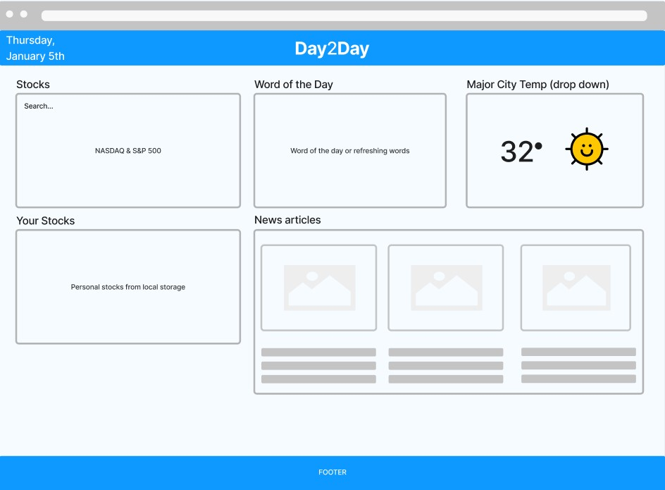

# Project 1 Details

## Project Title

The title of our project is "Day2Day"

## Project Description

Day2Day is a recent events dashboard that displays data for the current day; such as the current weather in a major city of the user's choosing, stocks of the user's choosing, and recent news articles, along with a word of the day to sharpen your vocabulary.

## User Story

- AS AN engaged citizen
- I WANT to view stock market performance, the current weather, and recent news in one place
- SO THAT I can stay up to date on current events

## Wireframe

To navigate to our FigJam wireframe in your browser, click [here](https://www.figma.com/file/acg46yQGkFdoqk2TkpWQwn/Recent-Events-Dashboard-Wireframe?node-id=0%3A1&t=ramp4LENwjUVasck-0)

## APIs to be used

- Stocks: [polygon.io](https://polygon.io/)
- News Articles: [https://newsapi.org/](https://newsapi.org/docs/get-started)
- Weather: [https://openweathermap.org/](https://openweathermap.org/api/geocoding-api)
- Random Words: [Words API](https://www.wordsapi.com/docs/#random-words)
  (or) Word of the Day: [APIs for Librarians](https://www.apis4librarians.com/wordnik/word-of-the-day)

## Breakdown of Tasks

- Implement basic HTML and CSS layout
- Implement stock API
- Implement the ability to track a specific stock(s)
- Implement word of the day/random word
- Implement news articles (dependent on relevance)
